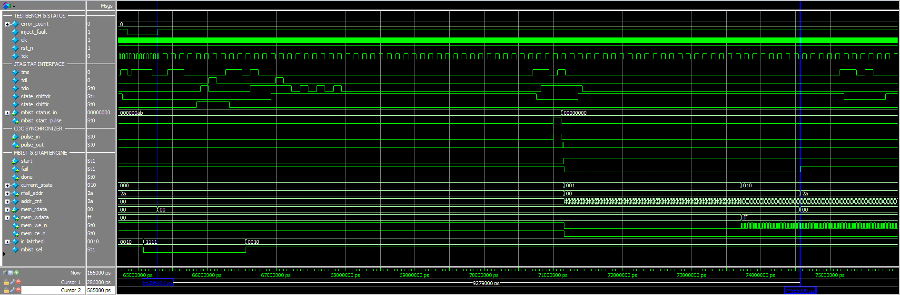

# JTAG IEEE 1149.1 TAP Controller & SRAM MBIST

## 1. Overview

### What is this project?
This project is an educational, simulation-level Design-for-Testability (DFT) system. It demonstrates the architecture and verification of an **IEEE 1149.1 standard JTAG TAP Controller** integrated with an on-chip **Memory Built-In Self-Test (MBIST) Controller** to test a simulated single-port SRAM model.

Written in Verilog, the design tackles critical Clock Domain Crossing (CDC) challenges between the asynchronous test clock (`tck`) and core clock (`clk`). It employs dedicated `cdc_pulse_sync` modules to safely pass single-cycle start and completion pulses without metastability, alongside `tck`-domain shadow registers that latch the test outcome and failing address until the next dispatch.

### Key Features
* **IEEE 1149.1 TAP Controller Model:** Standard 5 wire JTAG interface supporting instruction and data register scan sequences.
* **Dual Clock Domain Architecture (CDC):** Asynchronous separation between `TCK` and `CLK` domains using single cycle pulse synchronizers (`cdc_pulse_sync`) for start and completion handshakes.
* **Status Shadow Register:** Latches test results (`done`, `fail`, `rfail_addr`) safely in the `TCK` domain upon completion, retaining them until the next test run.
* **Functional Memory Isolation:** Multiplexes SRAM access between normal operation and test mode (`test_mode`), clamping functional read data (`func_rdata`) during BIST runs.
* **Fault Injection Simulation:** Built in verification input (`inject_fault`) within the SRAM model to trigger failure scenarios and verify detection logic.

---

## 2. System Architecture


### Color Coding
* **Pink Module (JTAG TAP):** IEEE 1149.1 TAP Controller interfacing external test pins (`tck`, `tms`, `tdi`, `trst_n`, `tdo`).
* **Green Module (CDC Synchronizer):** Bidirectional pulse synchronizer safely passing trigger and done pulses across clock boundaries (`mbist_start_cmd_tck` → `mbist_start_pulse_clk`, `done` → `mbist_done_pulse_tck`).
* **Grey Module (Status Capture Registers):** `TCK`-domain shadow registers capturing `fail` and `rfail_addr[7:0]` to pack into `mbist_status[31:0]`.
* **Yellow Module (MBIST):** Test pattern generator and comparator running at functional system clock frequency (`clk`).
* **Purple Module (MUX):** DFT multiplexers controlled by `test_mode` for SRAM bus switching and functional read isolation (`func_rdata[7:0]`).
* **Blue Module (SRAM):** Embedded memory model under test with dedicated hardware fault injection hook (`inject_fault`).

### Module Descriptions
* **`jtag_mbist_top` (Top-Level Wrapper):** Integrates the TAP controller, MBIST controller, CDC pulse synchronizers, isolation multiplexers, and SRAM behavioral model.
* **`jtag_tap_top` (JTAG TAP):** Implements the IEEE 1149.1 TAP FSM, Instruction Register (IR), and Data Registers (DR) for MBIST control/status.
* **`mbist_controller` (MBIST):** FSM executing the March C- algorithm to test SRAM; generates R/W cycles and checks for memory faults.
* **`cdc_pulse_sync` (CDC Synchronizer):** Safe toggle to pulse synchronizer passing single cycle events across unrelated clock domains (`tck` ↔ `clk`).
* **`sram_model` (SRAM):** Parameterized synchronous single port SRAM behavioral model with fault injection input.

---

## 3. Technical Implementation

### Clock Domain Crossing (CDC) & Status Register

| Domain | Clock Signal | Associated Logic Blocks | Function |
|---|---|---|---|
| **Test Domain** | `tck` | `u_jtag_tap`, Status Capture Registers | Scans in instructions/data, latches final pass/fail results |
| **System Domain** | `clk` | `u_mbist_ctrl`, `u_sram`, FSM | Executes MBIST algorithms at functional system clock frequency |

#### Synchronization Mechanism
1. **Start Trigger:** Setting `ctrl[0] = 1` in the MBIST Control DR asserts `mbist_start_cmd_tck` during `Update-DR`. This single cycle pulse in `TCK` is synchronized into `CLK` as `mbist_start_pulse_clk`.
2. **Test Run:** `mbist_start_reg` latches high, asserting `test_mode = 1` to route SRAM buses to `mbist_controller`.
3. **Completion & Register Capture:** The rising edge of `mbist_done` asserts an enable pulse (`mbist_done_pulse_tck`) in the `TCK` domain, synchronously capturing the static `fail` and `rfail_addr` values into shadow registers on the `TCK` clock edge.

### MBIST Testing Algorithm (March C-)

The `mbist_controller` executes the **March C-** algorithm to detect physical manufacturing defects in the SRAM.

* **Complexity:** $10N$ operations ($N$ = Number of memory cells).
* **Fault Coverage:** SAF (Stuck-At), TF (Transition), AF (Address Decoder), CF (Coupling).

#### Test Sequence:
1. $\{\Updownarrow (w0)\}$: Write 0 to all addresses.
2. $\{\Uparrow (r0, w1)\}$: Read 0, write 1 (Address counting up).
3. $\{\Uparrow (r1, w0)\}$: Read 1, write 0 (Address counting up).
4. $\{\Downarrow (r0, w1)\}$: Read 0, write 1 (Address counting down).
5. $\{\Downarrow (r1, w0)\}$: Read 1, write 0 (Address counting down).
6. $\{\Updownarrow (r0)\}$: Read 0 from all addresses.

#### JTAG MBIST Status Register Bit Mapping (32-bit `mbist_status`)

| Bit Range | Field Name | Description |
|---|---|---|
| `[31:10]` | `RESERVED` | Zero-padded bits |
| `[9:2]` | `RFAIL_ADDR[7:0]` | Address of the first detected memory failure |
| `[1]` | `FAIL` | MBIST test outcome (`1` = fail, `0` = pass) |
| `[0]` | `DONE` | Test completion flag (`1` = finished) |

---

## 4. Verification: Fault Injection



* **Fault Injection:** Active defect asserted (`inject_fault = 1`).
* **CDC Synchronization ($t \approx 71\,\mu\text{s}$):** Pulse transfer via `pulse_in` to `pulse_out` asserts `start` and triggers MBIST execution.
* **Fault Detection ($t = 74.56\,\mu\text{s}$, Cursor 2):** During the March read cycle (`current_state = 010`) at address `addr_cnt = 2a`, a data mismatch is detected.
* **Diagnostic Lock:** The `fail` flag immediately asserts High (`St1`), and `rfail_addr` locks onto the failing address `0x2A`.
* **Self-Checking Testbench:** `error_count` remains `0`, confirming all hardware assertions and status checks passed.

---

## 5. Repository Structure

```text
├── rtl/
│   ├── jtag_mbist_top.v       # Top-level integration (JTAG, CDC, MBIST, SRAM)
│   ├── jtag_tap_top.v         # IEEE 1149.1 TAP Controller and scan registers
│   ├── jtag_state_machine.v   # 16-state TAP FSM
│   ├── jtag_reg.v             # Instruction & Data register implementations
│   ├── cdc_pulse_sync.v       # Dual-clock domain pulse synchronizer
│   ├── cdc_level_sync.v       # Multi-flop level synchronizer
│   ├── mbist_controller.v     # Algorithmic March C- memory test engine
│   └── sram_model.v           # Synchronous SRAM model with fault injection hook
├── tb/
│   └── tb_jtag_mbist_top.v    # Self-checking testbench with JTAG scan tasks
├── sim/
│   ├── run.do                 # Automated compile, execution & waveform script
│   └── wave.do                # Formatted signal hierarchy and waveform layout
└── docs/                      # Architectural diagrams and verification waveforms
```

---

## 6. Simulation & Verification

The project includes an automated Tcl simulation flow and structured waveform setup for **ModelSim**.

### Prerequisites
* Mentor Graphics ModelSim
* Git

### Quick Start (Terminal)

```bash
git clone https://github.com/EilonOshri/jtag-mbist-sram-controller.git
cd jtag-mbist-sram-controller/sim
vsim -do run.do
```

### Alternative: Run directly inside ModelSim GUI
Open ModelSim -> File -> Change Directory to "sim" -> In Transcript type:
```bash
do run.do
```

---

## 7. Tools & Environment

* **Language:** Verilog
* **Simulation:** ModelSim / Quartus 
* **Waveform Viewing:** ModelSim Wave Viewer
* **Architecture Diagrams:** Excalidraw
